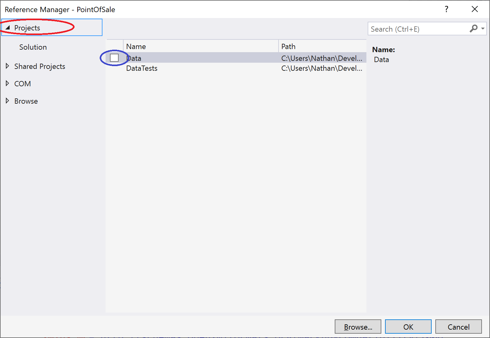
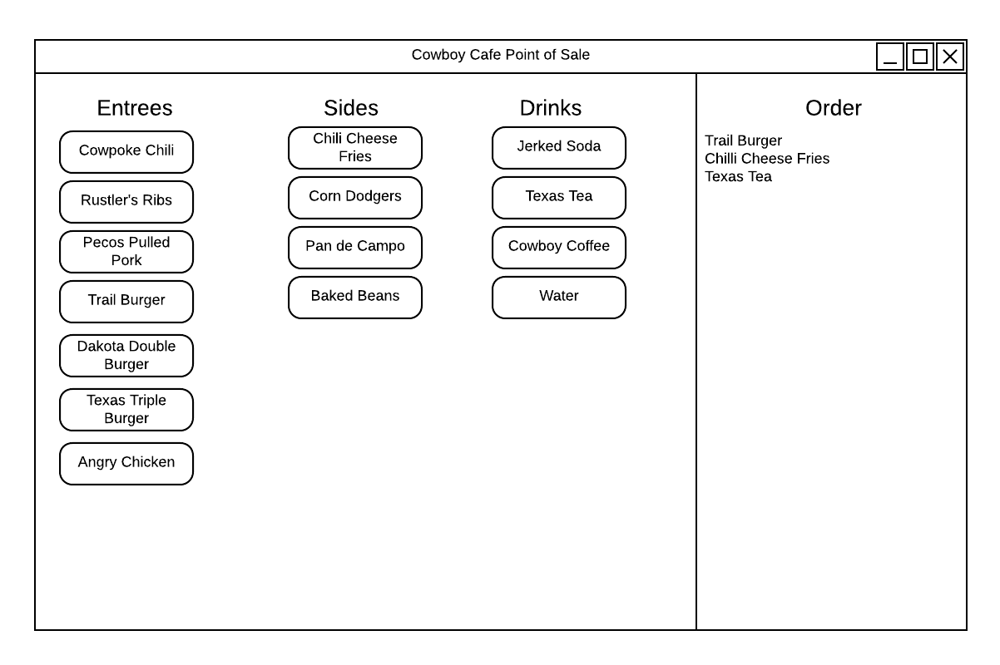

# Point of Sale Milestone 1

## Add Point of Sale projects

For this milestone, you will be creating a new project in your Cowboy Cafe solution.  This project represents the software that would be installed on a Point of Sale terminal in a restaurant (the cash register).  Its role is to allow the cashier to take an order, determine the total cost, take the customer's payment, calculate change (if necessary), track the expected cash in the drawer, and transmit orders to the cooks for fulfillment.

### General Requirements

You will need to follow the style laid out in the [C# Coding Conventions](https://docs.microsoft.com/en-us/dotnet/csharp/programming-guide/inside-a-program/coding-conventions).

Each new class should be declared in the **CowboyCafe.PointOfSale** namespace.

### Part 1: Create a WPF project

The first step is creating a project to represent your point of sale system.  Right-click your CowboyCafe solution and choose _Add > New Project_ from the context menu.  In the Add a New Project dialog, choose "WPF App (.NET Core)".  This is a _Windows Presentation Foundation_ application, a newer alternative to _Windows Forms_ that allows a much greater degree of customization. Name your project "PointOfSale".  

Once the project has been created, you'll probably want to make it launch when the _run_ button is clicked.  Right-click on the project in the Solution Explorer, and choose _Set as Startup Project_ from the context menu.

You'll also want to be able to access the data library you've built from within this project.  To do so, you must add it as a dependency to the new project.  Right-click the project's dependencies in the Solution Explorer and select _Add Reference_.  Check the box next to the _Data_ project:



## Part 2: Add An OrderControl

In the PointOfSale project, create a new item using the _UserControl (WPF)_ template named "OrderControl".  This should create two files: OrderControl.xaml and _OrderControl.cs_.  Edit your _OrderConrol.xaml_ to add [Buttons](https://www.c-sharpcorner.com/UploadFile/mahesh/xaml-button/) for each entree, side, and drink, ordered by category, and a [ListView](https://www.c-sharpcorner.com/uploadfile/mahesh/listview-in-wpf/) of items ordered.  You can expose these `Button`s and `ListView` in your C# file by giving them a unique `Name` attribute, i.e.:

```xaml
<Button Name="AddCowboyChiliButton"/>
```

In the C# file, add event listeners to your buttons to add the appropriate item to your `ListView` when the button is clicked.  This will result in the list displaying the name(s) of the classes ordered, i.e. `CowboyCafe.Data.CowboyChili`.

Your user interface should look something like the following mockup (you may tweak the look and arrangement, but all the buttons and the order list must be present):



## Part 3: Override ToString() on Menu Items

The `ListView` object invokes the `ToString()` method on each object added to it.  By default, the `ToString()` objects will return the fully-quantified name of the class.  This method can be overridden to provide a custom string.  

To make your order make sense, you will need to override the `ToString()` method for each of your menu item classes defined in the Data project.  In most cases, the `ToString()` should return the human-readable name of the menu item, i.e. "Cowboy Chili".  However, for sides the _size_ of the side should also be included, i.e. "Large Chili Cheese Fries".  Drinks should also specify their size, i.e. "Large Water".

The `CowboyCoffee` class should also indicate when the Coffee is decaffeinated, i.e. "Medium Decaf Cowboy Coffee", or "Large Cowboy Coffee" if the coffee is not decaffeinated.

The `JerkedSoda` class should also indicate the flavor, i.e. "Small Cream Soda Jerked Soda".  

If in doubt about the names, look at the ToStringTests.cs file in the DataTest project (You will need to pull from upstream to add it to your project).  These should be the names you use.
