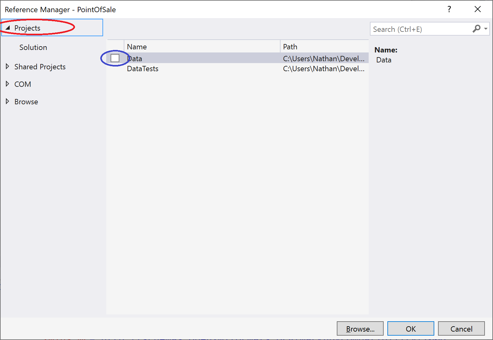

# Point of Sale Milestone 2

## Composing Orders

For this milestone, you will be expanding the Cowboy Cafe Point of Sale project and the Data project.  These expansions will allow a user to compose and customize an order using the user interface.

### General Requirements

You will need to follow the style laid out in the [C# Coding Conventions](https://docs.microsoft.com/en-us/dotnet/csharp/programming-guide/inside-a-program/coding-conventions).

Each new class should be declared in the **CowboyCafe.PointOfSale** or **CowboyCafe.Data** namespace, depending on the project it belongs to.

### Part 1: Add an Order class to your Data Project

Before we get too deep into creating an order, we need a better way to represent our orders - not just for _taking_ orders at the register, but also for supplying details to the cooks, and for keeping business records.  

This suggests we will want to add a new class to represent the data of an order.  This Order class should be defined in the Data project, and will need to collect all the order items into a collection, and provide a total price for the order.  We also want to record a unique order number that should be generated when the order is created (hint, you can keep track of this with a static variable).



As we want our Order class to be able to hold order items, and we want to be able to access properties like the price of these items without needing to explicitly cast, use reflection, or dynamic objects, we need to use some form of polymorphism to be able to treat different order items as the same type.  As we already have common properties across each of our order items (Price, SpecialInstructions) that meet this need, an interface is a good choice.  Name this interface IOrderItem.

Finally, in order for our Order class to properly update bound data properties, we need to implement the `INotifyPropertyChanged` interface found in the `System.ComponentModel` namespace.  This interface requires a `PropertyChanged` event handler to be implemented in the class, which will be invoked any time a property changes - i.e. it should be invoked for the `Items` property when an order item is added or removed from the order.

Note that implementing the `INotifyPropertyChanged` interface carries with it the expectation that a `PropertyChanged` event will be invoked _any time a public property on the class is changed_.  This is not enforced by Visual Studio, but is expected coding practice.  Thus, you should notify whenever the `Items` or `Subtotal` properties change (the `OrderNumber` should never change).

## Part 2: Add An OrderSummaryControl

In the PointOfSale project, you'll need to create a new control extending `UserControl` named `OrderSummaryControl`.  This control will take the place of the `ListView` currently displayed in your `OrderControl`, and will display the list of items in the order, along with their prices and special instructions.  A mockup of one possible implementation is:


You will want to use a _data binding_ to connect an `Order` instance to your `OrderSummaryControl`, so you can assume this binding as you write the control. Thus, if you want to display the `Subtotal` in a TextBox you can use XAML like:

```xaml
<TextBox Text="{Binding Path=Subtotal, StringFormat=c}"/>
```
The `Path=Subtotal` indicates we want to use the `Subtotal` property of the bound `Order` instance as the source of our text.  The `StringFormat=c` indicates we want this text to be formatted as currency.  As long as our binding is intact, this control will display the calculated price.  Moreover, the binding will subscribe to `PropertyChanged` events on the `Order` instance, so the bound values will automatically update after changes are made.

### Part 3: OrderControl Updates

Your `OrderControl` will likewise need to be refactored to utilize data binding and use component-based design principles.  You already started this process by separating the order summary into its own component `OrderSummaryControl`.  

We'll likewise want to separate your menu item selection screen into its own component `MenuItemSelectionControl`.  The buttons on this control should add the corresponding `IMenuItems` to the bound `Order` object as its buttons are pressed.  If this is bound correctly, and the `Order` properly implements the `INotifyPropertyChanged` interface, adding items to the `Order` instance should automatically update the list displayed in the `OrderSummaryControl`.

We'll also want to add three buttons to the screen to 1) return to the menu item selection screen, 2) Cancel the ongoing order, and 3) Finalize the ongoing order.  A mockup of what this might look like is:


At this point, the event handlers for the _Cancel Order_ and _Complete Order_ buttons should generate a new order and display it in the OrderControl. Hint: `this.DataContext = new Order()` creates a new `Order` object and binds it to the control.  The _Select Menu Item_ button does not need to have an effect yet.

As the current `Order` instance is bound to the `OrderControl` that is a parent to both the `OrderSummaryControl` and `MenuItemSelectionControl`, both of these will by default have the `Order` instance bound as their `DataContext`.  This is how the `OrderSummaryControl` can display the items collected in the order.  Similarly, you can invoke the `Add` method of the `Order` from the `MenuItemSelectionControl` if you cast its `DataContext` object into an `Order`.

### Part 4: Update UML
Finally, you should update your UML diagrams to reflect the new classes in the _PointOfSale_ and _Data_ projects.
