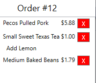

# Point of Sale Milestone 4

## Further Customizing Orders

For this milestone, you will be expanding the Cowboy Cafe Point of Sale project and the Data Test project.  These expansions will allow a user to further customize an order using the user interface, and will provide tests for the data class `INotifyPropertyChanged` functionality.

### General Requirements

You will need to follow the style laid out in the [C# Coding Conventions](https://docs.microsoft.com/en-us/dotnet/csharp/programming-guide/inside-a-program/coding-conventions).

Each new class should be declared in the **CowboyCafe.PointOfSale** or **CowboyCafe.Data** namespace, depending on the project it belongs to.

### Part 1: Launch Customization Screens from the OrderSummaryControl List
When the cashier clicks (or touches) an item in the `OrderSummaryControl` list, you should swap the current screen displayed in the `OrderControl` for a customization screen _with that specific IOrderItem bound to its DataContext_.  This allows the cashier to return to an already selected purchase, and edit its attributes.  **Hint:** The `ListBox` control has a `SelectionChanged` event handler that is triggered when an item is selected from the list.  Read more about it in the [documentation](https://docs.microsoft.com/en-us/dotnet/api/system.windows.controls.listbox?view=netframework-4.8).

This video demonstrates the desired functionality:

<iframe width="560" height="315" src="https://www.youtube.com/embed/NysUEG3S5Ug" frameborder="0" allow="accelerometer; autoplay; encrypted-media; gyroscope; picture-in-picture" allowfullscreen></iframe>

### Part 2: Add the Ability to Remove Items from the OrderSummaryControl List
You will also want to be able to remove unwanted items from the `OrderSummaryControl`'s list.  A standard practice for doing so is to add a button with an 'X' as a label to the right side of the list item:

  

You are free to use a different approach if you want, but it should be simple for the user to figure out.  Also, be sure that any buttons you do use are large enough for a touch screen.

### Part 3: Testing PropertyChanged Notifications
A core idea behind the `INotifyPropertyChanged` interface is that any class implementing it will invoke the `PropertyChanged` event handler _any time a public property changes_.  Note that this is not a _logical_ or _semantic_ requirement - not doing so will cause no errors nor crash the program - it is simply a convention that we expect programmers to observe.  However, failing to do so _can_ cause issues in our user interfaces, were the user interface may not stay synchronized with the underlying data object it represents - and this can be a serious problem.

It is surprisingly easy to miss some instances where a property is changing.  Therefore, it is a good idea to write tests to ensure that we are addressing each instance.  For this milestone you should test every class implementing `IOrderItem` for each property that is changing - that includes all _entrees_, _sides_, _drinks_ and the `Order` class.  You should test for _each_ property that can change, _whenever_ it changes.  For example, the `JerkedSoda`'s if the `Ice` property changes, both the `Ice` and `SpecialInstructions` properties should be the subject of a `PropertyChanged` event, and if the `Size` property changes, its `Size`, `Calories`, and `Price` properties all change.

#### Testing Demonstration
To help you get started, the following discussion and example code goes through writing the basic tests.  You can also watch a video of writing tests for the `AngryChicken` test class [here](https://youtu.be/2-DI6ryHIoE).

The first step would be ensuring the class implements the `INotifyPropertyChanged` interface, which we can do with the [Assert.IsAssignableFrom<T>()](http://rical.blogspot.com/2012/07/how-to-use-assertisassignablefrom-in.html) method.  For example, to test the `AngryChicken` class:

```csharp
[Fact]
public void AngryChickenImplementsINotifyPropertyChanged>()
{
    var chicken = new AngryChicken();
    Assert.IsAssignableFrom<INotifyPropertyChanged>(chicken);
}
```

The `Assert.IsAssignableFrom<INotifyPropertyChanged>(chicken);` checks that it is possible to cast `chicken` as Type `INotifyPropertyChanged`, which can only happen if it implements the interface.

Then we need to test every possible way we might change the properties of `AngryChicken`.  This is such a common task that XUnit has a built-in assertion to handle it, `Assert.PropertyChanged()`.  It takes three arguments: an object implementing `INotifyPropertyChanged`, a the property name of interest as a string, and an `Action` (a delegate method) that should cause the PropertyChanged event.  An example of using it to determine if the "Bread" property is changing:

```csharp
[Fact]
public void ChangingBreadPropertyShouldInvokePropertyChangedForBread()
{
    var chicken = new AngryChicken();
    Assert.PropertyChanged(chicken, "Bread", ()=>{
        chicken.Bread = false;
    });
}
```

We would need to write a similar method to test for the `SpecialInstructions` property changing.
