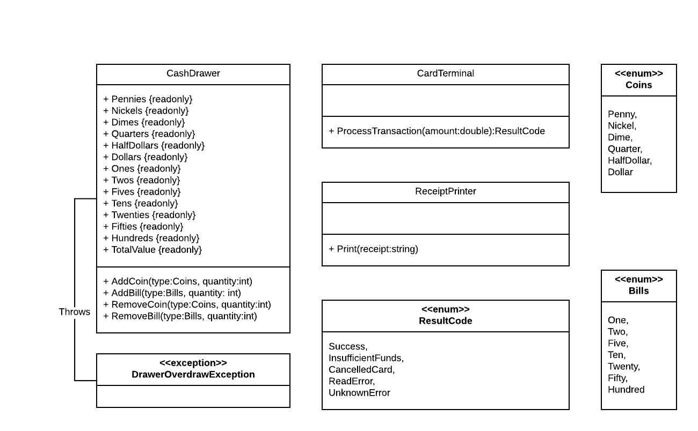

# Point of Sale Milestone 5

## Handling Transactions

Now we will turn our attention to the final part of taking an order - finalizing the transaction by taking payment.  We will be expanding the PointOfSale project to take money from the customer.  To facilitate this, we will be using a second-party DLL that operates a cash register, credit card terminal, and receipt printer.  As with many second-party libraries, we do not have access to the source code - only a public API (application programming interface).   

### The CashRegister.dll

The second-party DLL is the _CashRegister.dll_, and you will need to add it to your project.  Rather than installing it as a global DLL, you will add the file directly to your `PointOfSale` project folder, and add a reference to it by right-clicking the **Dependencies** of the project in the solution explorer and selecting **Add Reference**, then browsing to the DLL location.

The DLL provides several enumerations, one error, and three classes representing the credit card terminal, the cash register drawer, and the receipt printer, respectively.  The public methods are captured in this UML diagram:

### General Requirements

You will need to follow the style laid out in the [C# Coding Conventions](https://docs.microsoft.com/en-us/dotnet/csharp/programming-guide/inside-a-program/coding-conventions).

Each new class should be declared in the **CowboyCafe.PointOfSale** or **CowboyCafe.Data** namespace, depending on the project it belongs to.

### Part 1: TransactionControl

You will first need to write a UserControl to handle transactions. It should display the order information, including the order number, the list of order items, the subtotal, and a total (with a 16% sales tax applied).  It should also provide buttons or other controls to enable payment by credit, payment by cash, and to cancel the transaction.  It is up to you to determine how this control should look, but it should be easily for a user to understand.

When the "Complete Order" button in the OrderControl is clicked, you should display the transaction control.  If the transaction is cancelled, you should return to displaying the OrderControl, with a new order.  If the transaction is completed, you should likewise return to displaying the OrderControl, with a new order.

### Part 2: Payment by Credit

When payment by credit is selected, you should process the transaction using an instance of the `CardTerminal` class defined by the _CashRegister.dll_.  The `CardTerminal` class has one method - `ProcessTransaction()` which takes the amount to charge as a double.  It processes the card swiped and returns a `ResultCode` enum value corresponding to "Success", "InsufficientFunds", "CancelledCard", "ReadError", or "UnknownError".  If the result is "Success", you should finish the order by printing a receipt, and returning to the ordering screen with a new `Order` object.  If the result is any kind of error, you should inform the user and display the transaction screen so the cashier can attempt a different method of payment.

### Part 3: Payment by Cash

When payment by cash is selected you should process the transaction using an instance of the `CashDrawer` class defined in the _CashRegister.dll_.  To do so, you should provide the user with an interface for inputting the amount of cash given by the customer.  This should _not_ be a flat amount (i.e. $15.00), but rather a quantity of denomination (i.e. one $10 bill and one $5 bill) as the cash drawer tracks the number of individual bills and coins.  You should also display a running total of the payment as bills are added.  Once sufficient payment has been made, you should notify the cash drawer that payment is being added by invoking its `AddBill()` and `AddCoin()` methods.  

Once this is done, you should prompt the user to give the appropriate change.  You will need to _calculate_ the appropriate amount, and inform the user by displaying the quantity and denomination of bills and coins they are to give as change.  The change you instruct the user to give _should also be available in the drawer_.   The various denomination methods defined in the `CashDrawer` class will let you know how much of each denomination is available.  Additionally, you should invoke the `RemoveBill()` and `RemoveCoin()` methods of the cash drawer to adjust the inventory of the drawer based on the change given.

__Important Note:__ When constructed, the `CashDrawer` class initializes its inventory based on a standard opening amount.  Thus, you must use the _same_ instance of `CashDrawer` for every transaction, or the count of bills and coins _will not reflect the outcome of prior transactions_!

### Part 4: Receipt Printing

Every time you finalize a transaction (cash or credit), you should also print a receipt using the `ReceiptPrinter` class defined in _CashRegister.dll_.  This class has one method, `Print()` which takes a string to print as an argument.  The entire history of printed receipts is outputted to a file, _receipt.log_, which can be found in your project's binary folder (_PointOfSale/bin/Debug/netcoreapp3.1_ for mine).  Be aware that the paper tape used by the receipt printer is limited to 60 characters, so no individual line should exceed that.

You should print: The order number, the current date and time, the individual order items with price and special instructions, the subtotal, the total with tax.  If a credit card was used, it should indicate credit, and if cash transaction was made, it should indicate the total paid and the change that was given.  This can be a bulk amount, i.e. $16.50 paid, $0.23 change.
