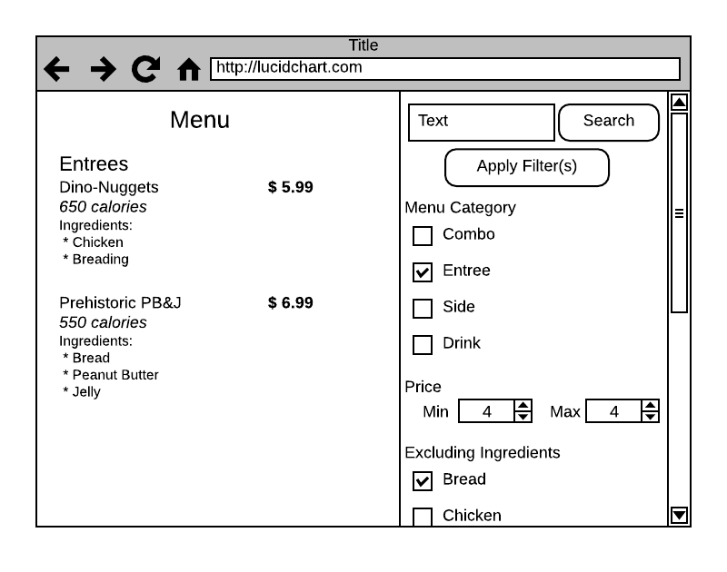

# Website Milestone 2 - Search and Filter

For this milestone you will be refactoring the Menu page for the DinoDiner franchise website, as well as the `Menu` class from the `DinoDiner.Menu` project, to support filtering and searching menu items.

## Search/Filter Sidebar (10 points possible)
Modify your _Menu.cshtml_ to display a form (with the "method" attribute set to "post") along the right side of the menu page.  This sidebar should be broken into sections, as detailed in the below requirements.  A mockup of this sidebar is:

## Search Section (5 points possible)
This section should feature a text input with name "search", id "search", and a input with type "submit" and value "Search."

## Filter Button (5 points possible)
An input with the type "submit" with the name "filter", id "filter", and value "Apply Filter(s)".  Alternatively this can be combined with the search button as a "Search and Filter" button.

## Category Filter UI (10 points possible)
A series of inputs with type "checkbox" corresponding to menu categories with HTML class "menu-category", name "menuCategory", and value matching the category ("Combo", "Entree", "Side", and "Drink").  These should be clearly identifiable as filters and use labels corresponding to the value.

## Category Filter Functionality (10 points possible)
When the form is submitted with a category filter applied, only those items within the matching category(ies) are displayed.

## Price Filter UI (10 points possible)
Two inputs of type "number" for maximum and minimum price filtering.  The minimum should have an id of "minimum-price", a name of "minimumPrice".  The maximum should have an id of "maximum-price", and a name of "maximumPrice".  These should also be clearly identified as filtering for minimum and maximum prices.

## Price Filter Functionality (15 points possible)
When the form is submitted with a maximum price filter value, only the menu items with a price of less than or equal to the maximum are displayed.  Similarly, the form is submitted with a minimum value, only the menu items with a price of more than or equal to the minimum are displayed.  

## Ingredient Filter UI (20 points possible)
A series of checkbox inputs corresponding to ingredients to exclude with HTML class "exclude-ingredient".  These will need to be generated from the possible ingredient values represented by the Menu class's `PossibleIngredients` property (a new property to be added).  The checkbox name should correspond to the ingredient, and the value should be the exact ingredient string. _Hint: add a method to your Ingredients class that creates a list of unique ingredients from all menu items.  A HashSet may be useful._

## Ingredient Filter Functionality (15 points possible)
When ingredient filters are specified, only those menu items that do NOT include those ingredients are displayed.
