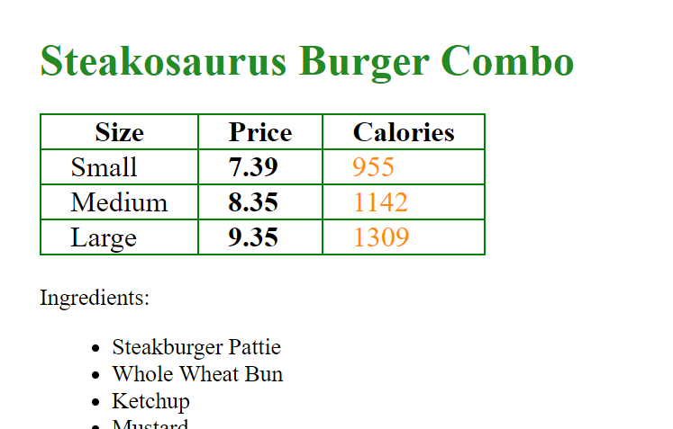

# Website Milestone 3 - LINQ

For this milestone you will be refactoring the Menu page for the DinoDiner franchise website to leverage LINQ to filter, search, and sort the menu items.

# Search (15 Points)
Refactor the search functionality in your _Menu.cshtml.cs_ to use a LINQ [Enumerable.Where](https://docs.microsoft.com/en-us/dotnet/api/system.linq.enumerable.where?view=netframework-4.8) method.

# Filter by Price (15 Points)
Refactor the price filter functionality (max and min price) in _Menu.cshtml.cs_ to use a LINQ
[Enumerable.Where](https://docs.microsoft.com/en-us/dotnet/api/system.linq.enumerable.where?view=netframework-4.8) method.

# Filter by Ingredients (20 Points)
Refactor the Ingredients filter functionality in _Menu.cshtml.cs_ to use a LINQ [Enumerable.Where](https://docs.microsoft.com/en-us/dotnet/api/system.linq.enumerable.where?view=netframework-4.8) method.

# Display By Category (20 Points)
Display your menu items in the _Menu.cshtml_ page by category, under menu category headers, i.e. ("Cretaceous Combos", "Entrees", "Sides", and "Drinks", as was specified in Milestone 1).  You may find the LINQ [Enumerable.OfType<>](https://docs.microsoft.com/en-us/dotnet/api/system.linq.enumerable.oftype?view=netframework-4.8) method helpful.

# Combo Display (10 Points)
Refactor the combo display list in _menu.cshtml_ to display the calories and price for each combo by size in a table.

A mockup of how this can be achieved is:

# Side Display (10 Points)
Refactor the side display list in _menu.cshtml_ to display the calories and price for each side by size in a table.

# Drink Display (10 Points)
Refactor the drink display list in _menu.cshtml_ to display the calories and price for each drink by size in a table.
