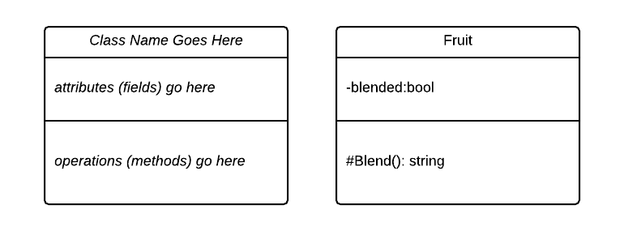
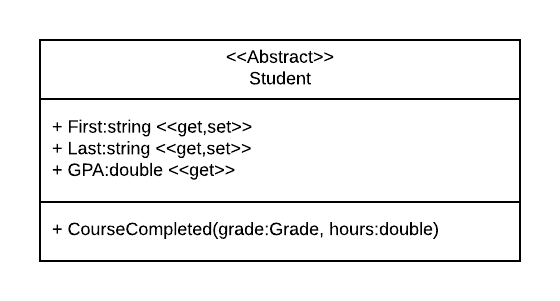
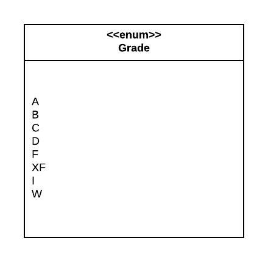

### Class Diagrams

Unified Modeling Language (UML) was created as a way of expressing the structure and behavior of an object-oriented program visually.  It actually consists of a number of different diagrams, but for our current purposes, we'll focus on one, the _class diagram_.  

A class diagram is a visual representation of a class' structure.  It consists of three compartments corresponding to:
1. The identity of the class (it's name, or in CS terms, Type)
2. The attributes (fields and properties) of the class
3. The operations (methods) of the class.

This structure can be seen in the following figure:



The first box labels three compartments of the UML class diagram, while the second corresponds to the following C# class:

```csharp
public class Fruit
{
    // private state
    private bool blended;

    /// <summary>
    /// Returns the result of blending the fruit
    /// </summary>
    protected string Blend() {
      blended = true;
      return "A pulpy mess, I guess";
    }

}
```

## Typed Elements

Notice the field and method in the UML diagram specify their type after a colon (`:`).  These correspond to the UML _typed element_ specifier, which follows this format:


__[visibility] typed element : type [{Constraints}]__

The __visibility__ modifier is optional, and corresponds to one of:
1. `+` for public
2. `#` for protected
3. `-` for private

The __typed element__ is the symbol (the name) of the element, and the __type__ is its type.

The optional __{constraints}__ can define limits on the values allowed in the field, i.e. that the value must fall within a specific range.

Some examples are:

* `+ Name:string`
* `+ Magnitude: double {Magnitude: >= 0}`
* `- credits: uint`

Constraints are defined using the pattern:

__{name: boolean expression}__

Where the __name__ is the name of the typed element, and the __boolean expression__ is an expression limiting its value, as the constraint on Magnitude above is limited to positive numbers.

## Operations

In UML, operations refer to the methods of a class.  The format for an operation is:

__[visibility] name (parameter list) [:type][{constraints}]__

The visibility symbols are the same as for typed elements.  The name is the method name.  The parameter list is a comma-separated list of typed elements, corresponding to the method parameters.  This is followed by an optional return type (it can be omitted if the return type is void).  Finally, it is followed by an optional constraints set.

## Stereotypes

UML is intended to be language-agnostic, however, there are often language-specific details we would like to include in a particular UML diagram.  _Stereotypes_ are the mechanism used to do so.  
a stereotype is surrounded by a double pair of angle brackets:

__<<stereotype>>__

and can be used to impart language-specific details.  Some examples from C# are:

### Properties

Properties are a unique feature of C# that let us define getters and setters that are used like fields in our code.  In UML, properties and fields would be indistinguishable, so we use stereotypes to indicate a getter and/or setter, i.e.:

+ SomeField:bool
+ SomeProperty:bool <<get,set>>
+ SomeReadOnlyProperty <<get>>

If a stereotype with a get or set (or both) follows an attribute, this indicates it is a property.  If not, it is a field.

### Abstract

Stereotypes can also be used to indicate an abstract class, by adding it before the class name in a diagram:



### Enums

Similarly, a stereotype can indicate an enum:

