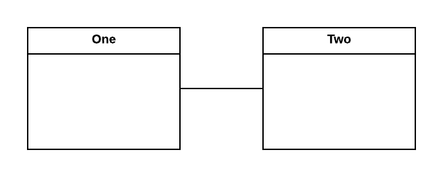
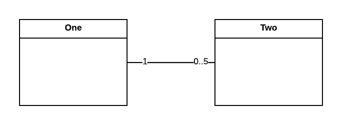

## Associations

When two classes communicate directly with one another, we refer to this as an _association_.  In UML, we model this relationship with a line connecting the two classes:

## Multiplicity

We can also add quantifiers to specify how many _objects_ of each class are involved in the association (the multiplicity).  For example, if one `One` object communicates with zero to five `Two` objects, we would annotate the diagram like this:

The quantity can be expressed as an exact value (i.e. __5__), a range (i.e. __2..4__), or a range with no upper bound (using an asterisk: __0..*__).

## More Specific Associations

In addition to the generic association, more specific forms of association exist, and the more specific form should be used when applicable.  We'll discuss these next.
