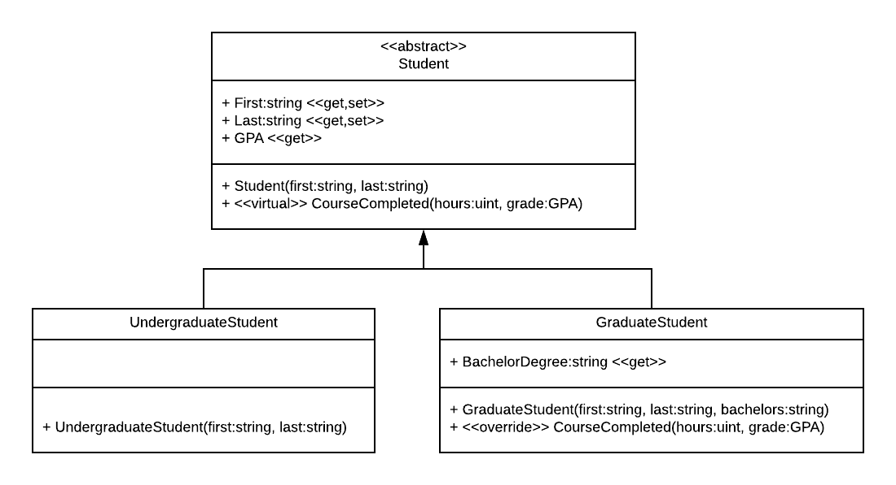

# Generalization

We've already discussed the first of the more specific forms of association, _generalization_.  Generalization refers to extracting the shared characteristics (state and behavior) and moving them into a base class.  Thus, generalization is the UML way of expressing inheritance.

Generalization is indicated by an arrow from the derived class(es) to the base class:

Generalization is often described as a **_is-a_** relationship.  In the example, an graduate student **_is-a_** student - it has all the characteristics of a student, plus those unique to a graduate student.

## Multiplicity
Multiplicities are not specified with generalization.

## Code Implementation
Generalization is implemented in object-oriented languages as inheritance.
