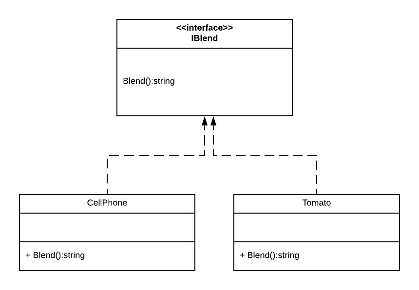

# Realization

We've also already worked with realization, which is the application of Interfaces.  Realization is indicated by a dashed arrow from the implementing class to the interface it implements:

## Multiplicity
As with generalization, realization does not specify multiplicity.

## Code Implementation

In C# and Java, realization is implemented through the use of Interfaces, while in C++ it is accomplished through abstract base classes (Interfaces in the latter two languages were created to address challenges of the C++ implementation, which included [multiple inheritance](https://en.wikipedia.org/wiki/Multiple_inheritance) and its potential for problems).
