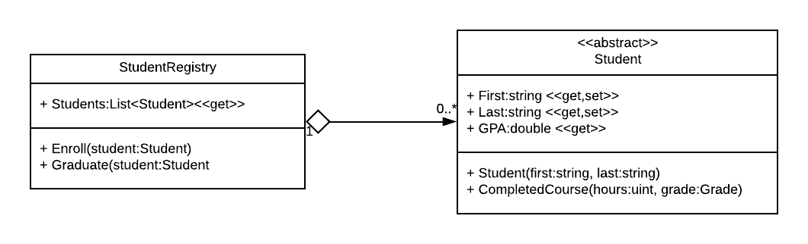

# Aggregation

Another more specific form of association is _aggregation_, which gathers instances of a class within another class.  It is indicated by a line with a open diamond instead of an arrowhead:

This is often described as a __*has-a*__ relationship.  Moreover, aggregation is a _weak_ has-a relationship, because the collected objects can exist without the containing object.  In our example, we could have students that are not part of the student registry object (i.e. alumni).

## Multiplicity

Note too that aggregation _does_ use multiplicity.

## Code Implementation

As you might have guessed from the UML example, aggregation is implemented in an object-oriented language through the use of fields - the _has-a_ object has a field that references an instance of the object it has.  Multiplicities can be achieved with multiple fields (i.e. `Cell:PhoneNumber`, `Home:PhoneNumber` ) or by the use of a collection (i.e. the `Students` field in the `StudentRegistry`).
