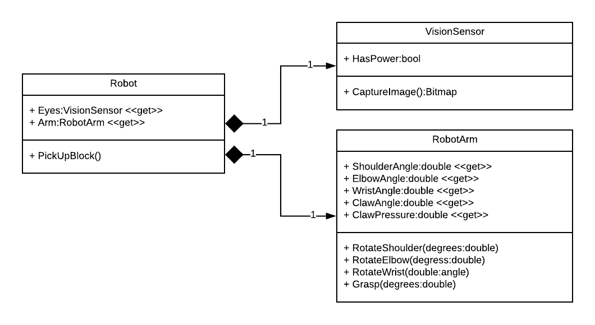

# Composition

_Composition_ is very similar to aggregation.  It also indicates a _**has-a**_ relationship, but this time it is a _strong_ has-a relationship, meaning if the composing class is disposed of, so are the objects it is composed of.  It is specified with a filled diamond:

## Multiplicity

As with aggregation, composition does typically include multiplicity.

## Code Implementation

Just as with aggregation, composition is implemented through fields.  However, as the lifecycle of the composed object and the objects it is composed of are more tightly tied together, it is common to see the composed elements constructed by the composing element, and (in non-memory-mangaged languages) also disposed of by that element when it is deleted. 
